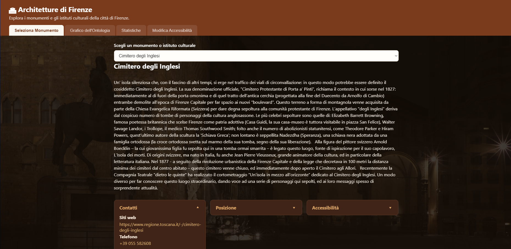
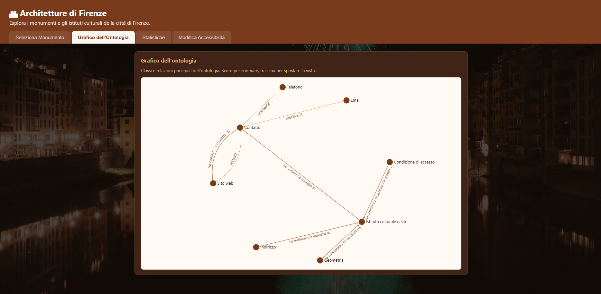
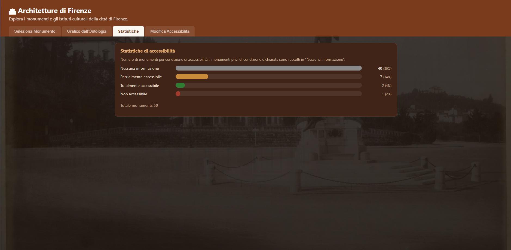
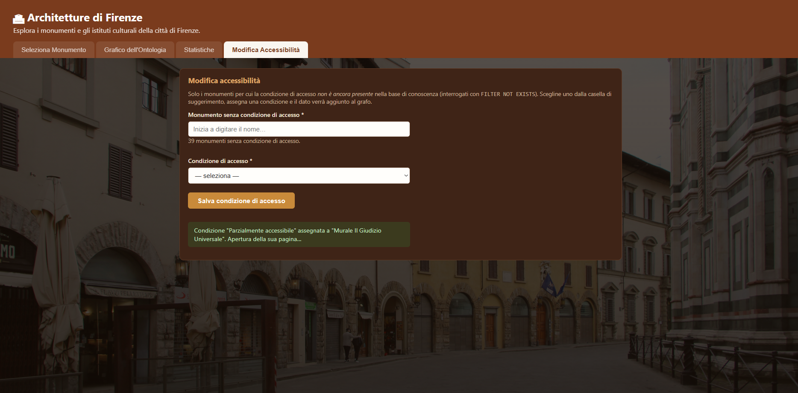

# CulturalMonument-TBox

Conversione automatica da **A-Box a T-Box** dei dati aperti sulle architetture e
i monumenti del Comune di Firenze, con una **web app** per esplorare l'ontologia
risultante.

Il progetto parte da un file di soli *fatti* (`architetture_firenze.ttl`, un
export Open Data del Comune di Firenze) e ne induce automaticamente uno *schema*
ontologico OWL (`architetture_firenze_fixed.ttl`), coerente e validabile da un
reasoner. Sopra il file finale gira una piccola applicazione Flask che permette
di consultare i monumenti, visualizzare l'ontologia, calcolare statistiche e
modificare alcuni dati.

---

## Indice

- [Cos'è una A-Box e cos'è una T-Box](#cosè-una-a-box-e-cosè-una-t-box)
- [I file principali](#i-file-principali)
- [La pipeline di conversione A-Box → T-Box](#la-pipeline-di-conversione-a-box--t-box)
  - [Stadio 1 — Analisi della A-Box](#stadio-1--analisi-della-a-box)
  - [Stadio 2 — Formazione dello schema](#stadio-2--formazione-dello-schema)
  - [Stadio 3 — Generazione degli assiomi](#stadio-3--generazione-degli-assiomi)
  - [Rifinitura finale (`refine.py`)](#rifinitura-finale-refinepy)
- [Come eseguire la pipeline](#come-eseguire-la-pipeline)
- [La Web App](#la-web-app)
  - [Avvio](#avvio)
  - [Sezione 1 — Seleziona Monumento](#sezione-1--seleziona-monumento)
  - [Sezione 2 — Grafico dell'Ontologia](#sezione-2--grafico-dellontologia)
  - [Sezione 3 — Statistiche](#sezione-3--statistiche)
  - [Sezione 4 — Modifica Accessibilità](#sezione-4--modifica-accessibilità)
- [Note tecniche](#note-tecniche)
- [Contributors](#contributors)

---

## Cos'è una A-Box e cos'è una T-Box

Nella logica descrittiva su cui si fondano le ontologie OWL si distinguono due
livelli:

- la **A-Box** (*Assertional Box*) è l'insieme dei **fatti** sui singoli
  individui: «esiste Piazza del Duomo», «ha questo indirizzo», «ha queste
  coordinate». È un elenco di asserzioni, senza regole.
- la **T-Box** (*Terminological Box*) è lo **schema**: definisce le classi
  (cos'è un "monumento", cos'è un "indirizzo"), le proprietà che le collegano,
  i loro domini e codomini, i vincoli (cardinalità, disgiunzioni, inversi).

Il file di partenza è una A-Box pura: tanti fatti, nessuna grammatica. L'obiettivo
del progetto è **far emergere la T-Box implicita nei dati** e riscrivere il tutto
in una forma pulita e consistente.

---

## I file principali

| File | Ruolo |
|------|-------|
| `architetture_firenze.ttl` | **Input grezzo**: A-Box di partenza (Open Data del Comune di Firenze). Solo individui, nessuno schema, artefatti di export. |
| `architetture_firenze_fixed.ttl` | **Output finale**: ontologia completa (T-Box + A-Box ripulita), consistente, usata dalla web app. |
| `architetture_firenze_additions.ttl` | Triple aggiunte a runtime dalla web app (es. condizioni di accesso assegnate dall'utente), tenute separate dal file curato. |
| `main.py` | Punto di ingresso della pipeline di conversione. |
| `scripts/` | I moduli della pipeline (analisi, costruzione T-Box, rifinitura, ecc.). |
| `webapp/` | L'applicazione Flask di esplorazione. |

### Struttura di `scripts/`

| Modulo | Responsabilità |
|--------|----------------|
| `pipeline.py` | Orchestratore: implementa i 3 stadi del metodo di Zengeya et al. |
| `analyzer.py` | **Stadio 1**: analizza la A-Box e deduce classi, proprietà, cardinalità, caratterizzazioni logiche. |
| `builder.py` | **Stadio 2–3**: riconcilia le classi e genera gli assiomi OWL della T-Box. |
| `llm.py` | Arricchimento opzionale (etichette/commenti) tramite un LLM locale (Ollama). |
| `refine.py` | **Rifinitura finale**: pulizia e modellazione che produce il file `_fixed`. |
| `constants.py` | Prefissi, soglie (`τ_sub`, `τ_sim`, `τ_dom`) e insiemi di filtraggio. |
| `metrics.py`, `report.py` | Validazione con reasoner e report di sintesi. |

---

## La pipeline di conversione A-Box → T-Box

La conversione **non usa regole cablate**: nessuna classe o proprietà è scritta a
mano nel codice. Tutto viene **dedotto osservando i dati**, seguendo il metodo a
tre stadi proposto da **Zengeya et al.** Le soglie che governano le deduzioni
sono in [`scripts/constants.py`](scripts/constants.py): `τ_sub = 0.7` (inclusione
tra classi), `τ_sim = 0.6` (similarità lessicale), `τ_dom = 0.75` (confidenza su
dominio/codominio).

### Stadio 1 — Analisi della A-Box

Realizzato da `analyze_abox` in [`scripts/analyzer.py`](scripts/analyzer.py).
Scorre tutte le triple e ricostruisce la struttura implicita:

- **Classi**: raccolte dai `rdf:type` degli individui.
- **Object vs Datatype property**: una proprietà è *object* se punta a un'altra
  risorsa (es. `cis:hasSite`), *datatype* se il valore è un letterale
  (es. `l0:name "Piazza del Duomo"`). Alcune URI che sono in realtà *valori*
  (es. l'URL di un sito web) vengono forzate a datatype property (`xsd:anyURI`).
- **Dominio e codominio con confidenza** (*Rule 2*): per ogni proprietà si conta
  a quali classi appartengono soggetti e oggetti; si propone il dominio/range più
  frequente, con la relativa percentuale. Solo gli assiomi sopra `τ_dom` passano.
- **Caratterizzazioni logiche**: funzionale (nessun soggetto con più valori),
  inverse-funzionale (nessun valore condiviso), simmetrica, transitiva, e le
  coppie inverse.
- **Vincoli di cardinalità**: per ogni coppia classe–proprietà si misura il
  minimo e il massimo di valori per individuo (es. ogni monumento ha *esattamente
  un* sito; l'email del punto di contatto è *opzionale, al più una*).
- **Candidati `SubClassOf`** (*Rule 1*): coppie di classi con estensioni
  sovrapposte oltre `τ_sub` e nomi lessicalmente simili oltre `τ_sim`.

### Stadio 2 — Formazione dello schema

`detect_equivalent_classes` in [`scripts/builder.py`](scripts/builder.py)
**riconcilia le classi duplicate** (stesso concetto in namespace diversi),
sceglie un rappresentante canonico e risolve i `SubClassOf` reciproci tenendo
solo la direzione specifico → generico. In via opzionale, gli stadi
`stage2b/2c` (modulo [`scripts/llm.py`](scripts/llm.py)) usano un LLM locale per
arricchire etichette e commenti e rivedere gli assiomi a bassa confidenza — è
una rifinitura, non una sostituzione: la sostanza resta dedotta dai dati.

### Stadio 3 — Generazione degli assiomi

`build_tbox` **scrive l'ontologia OWL**: dichiara le `owl:Class`, le
`owl:ObjectProperty` / `owl:DatatypeProperty` con `rdfs:domain` e `rdfs:range`,
le caratterizzazioni (funzionale, transitiva, inversa…), le **disgiunzioni** tra
classi che non condividono proprietà e le **restrizioni** di cardinalità. Con
`build_merged`, la T-Box viene poi ricucita con la A-Box ripulita: ogni individuo
diventa un `owl:NamedIndividual`.

### Rifinitura finale (`refine.py`)

[`scripts/refine.py`](scripts/refine.py) trasforma l'output "grezzo" nella forma
definitiva (`architetture_firenze_fixed.ttl`). Ogni incongruenza del file di
partenza trova qui la sua risposta:

- **pulizia letterali**: rimozione delle virgolette CSV e dei commenti di
  provenienza;
- **geometria appiattita**: il nodo reificato `clv:Geometry` diventa un'entità
  `afi:Geometria`, raggiunta da `afi:haCoordinate` (con inverso `afi:eCoordinataDi`);
- **contatti riorganizzati**: classe padre `afi:Contact` con `WebSite`/`Email`/
  `Telephone` come sottoclassi, collegate da `afi:haContatti` / `afi:eContattoDi`;
- **condizioni di accesso collassate** in poche categorie condivise
  (*Non accessibile*, *Parzialmente accessibile*, *Totalmente accessibile*), con
  il dettaglio del singolo monumento spostato in `afi:accessibilityNote`;
- **mereologia `afi:isPartOf`** dedotta dal pattern «Prefisso - Dettaglio» delle
  etichette (es. "Torre di Palazzo Vecchio" → fa parte di "Palazzo Vecchio");
- **inversi materializzati**, così che nessuna entità resti un "vicolo cieco";
- **consistenza con il reasoner**: tag di lingua `@it`, range `rdfs:Literal` dove
  servono, potatura di termini spuri e classi vuote, etichette italiane uniche.

> **Nota onesta**: la rifinitura sistema l'intera *struttura* e i testi brevi; gli
> errori di codifica (mojibake) nelle lunghe descrizioni `arco:description`
> restano un residuo del file di origine. La web app li corregge *a runtime*
> (vedi [Note tecniche](#note-tecniche)).

---

## Come eseguire la pipeline

Requisiti in [`requirements.txt`](requirements.txt) (Python 3.12+):

```bash
python -m venv .venv
.venv\Scripts\activate        # Windows
pip install -r requirements.txt
```

Conversione completa di un file A-Box:

```bash
python main.py architetture_firenze.ttl --output architetture_firenze_fixed.ttl
```

I flag `--merge --flatten --dedup --fix-labels --extract-desc --merge-site --refine`
sono attivi per default (vedi [`main.py`](main.py)). L'arricchimento LLM richiede
un'istanza locale di [Ollama](https://ollama.com); senza di essa la pipeline
prosegue regolarmente saltando gli stadi opzionali.

---

## La Web App

Applicazione [Flask](webapp/app.py) che carica `architetture_firenze_fixed.ttl`
in un grafo RDF in memoria e lo interroga via **SPARQL**. Tutte le sezioni
leggono direttamente dall'ontologia: la web app è, di fatto, una vetrina di ciò
che il passaggio A-Box → T-Box ha reso possibile.

### Avvio

```bash
cd webapp
python app.py
# poi apri http://localhost:5000
```

L'interfaccia è organizzata in **quattro sezioni**, raggiungibili dalle schede in
alto. Di seguito, per ciascuna, cosa fa e cosa mostra.

---

### Sezione 1 — Seleziona Monumento

Punto di partenza dell'esplorazione: si sceglie un monumento da un menu a tendina
e si apre una scheda di dettaglio completa, costruita interrogando l'ontologia.

La scheda raccoglie, in più riquadri:

- **Descrizione** del bene (`arco:description`) e dati anagrafici (`l0:name`);
- **Contatti** — sito web, email e telefono — raggiunti seguendo la catena
  `afi:haContatti+` (proprietà transitiva: dal monumento al sito web, e dal sito
  web a email/telefono);
- **Indirizzo** (`clv:fullAddress`) con **mappa** interattiva ricavata dalle
  coordinate `geo:asWKT`;
- **Condizioni di accesso** (categoria condivisa + eventuale nota di dettaglio);
- **Galleria fotografica**, caricata da Wikimedia Commons a partire dal nome del
  monumento;
- **Grafo del monumento**: la porzione di A-Box dell'entità selezionata,
  esplorata con una visita a 2 salti lungo le sue object property;
- **Monumenti vicini**: i 5 più prossimi in linea d'aria, calcolati con la
  formula dell'*emisenoverso* (haversine) sulle coordinate.



---

### Sezione 2 — Grafico dell'Ontologia

Visualizzazione della **T-Box**: il vero risultato della conversione. Il grafo
mostra le **classi** dell'ontologia, le relazioni di **sottoclasse**
(`rdfs:subClassOf`, archi tratteggiati) e le **object property** che le
collegano, etichettate con dominio e codominio. Le coppie inverse
(`owl:inverseOf`) sono fuse in un unico arco bidirezionale (es. *"ha contatti" /
"è contatto di"*) per non sovrapporre due frecce opposte.

È la sezione che rende visibile, a colpo d'occhio, lo schema che prima non
esisteva nel file grezzo.



---

### Sezione 3 — Statistiche

Conteggio dei monumenti per **condizione di accessibilità**, presentato come
grafico. Dietro le quinte c'è una query SPARQL di aggregazione (`GROUP BY` +
`COUNT`) con un `OPTIONAL`: i monumenti privi di condizione dichiarata non vengono
esclusi, ma raggruppati sotto la voce *"Nessuna informazione"*. È l'applicazione
pratica della **Open World Assumption**: l'assenza di un dato non equivale a
"falso", va rappresentata esplicitamente.



---

### Sezione 4 — Modifica Accessibilità

Form che permette di **assegnare una condizione di accesso** a un monumento che
ne è privo, scegliendo tra le tre categorie condivise dell'ontologia. La sezione
propone solo i monumenti effettivamente *senza* condizione (individuati con
`FILTER NOT EXISTS`).

L'inserimento avviene tramite una query **SPARQL `CONSTRUCT`** che genera l'unica
tripla mancante (`?monumento ac:hasAccessCondition ?categoria`):

- il `FILTER NOT EXISTS` garantisce che un dato esistente **non venga mai
  sovrascritto**;
- la categoria viene *trovata nel grafo* per pattern matching sulla sua
  etichetta, non costruita a mano;
- i parametri arrivano via `initBindings` come termini RDF già tipizzati (niente
  interpolazione di stringhe → niente SPARQL injection).

Le triple aggiunte vengono salvate in `architetture_firenze_additions.ttl`,
separato dal file curato, così da persistere tra i riavvii senza riformattare
l'ontologia principale.



---

## Note tecniche

- **Correzione del mojibake a runtime**: il file di origine porta testi UTF-8 mal
  decodificati come Windows-1252 (es. `città ` → `città`). La funzione
  `fix_mojibake` in [`webapp/app.py`](webapp/app.py) li ripara in lettura,
  ricostruendo i byte originali e ridecodificandoli correttamente, senza alterare
  il file su disco.
- **SPARQL ovunque**: ogni sezione della web app è alimentata da query SPARQL
  (`SELECT`, `CONSTRUCT`, aggregazioni) sul grafo dell'ontologia — non da accessi
  diretti a strutture dati Python.
- **Distanze geografiche**: SPARQL puro non offre funzioni geospaziali senza le
  estensioni GeoSPARQL, di coonseguenza la distanza tra monumenti è calcolata in Python
  (haversine) sulle coordinate estratte dai letterali `geo:asWKT`.
- **Validazione**: l'ontologia finale è pensata per passare il controllo di
  consistenza con un reasoner (HermiT), cosa priva di senso sul file di partenza,
  che non conteneva alcuno schema.

---

## Contributors

- [Chiara Puglia](https://github.com/chiarapuglia99) — Master's Degree Student in Computer Science, curriculum Data Science and Machine Learning
- [Luca Giuliano](https://github.com/Kizorat) — Master's Degree Student in Computer Science, curriculum Data Science and Machine Learning
